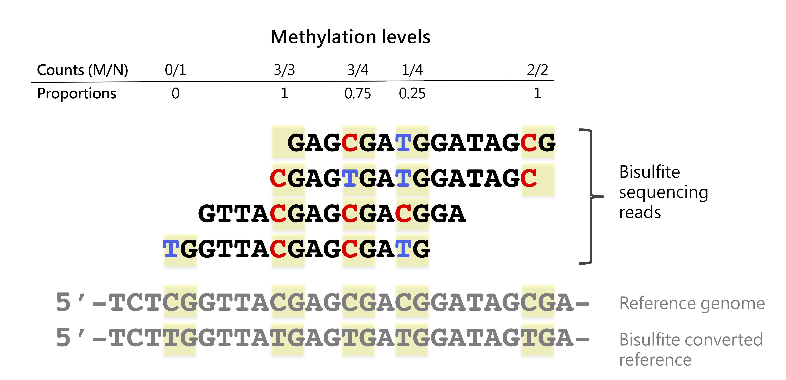

  
```{r setup, include=FALSE}
knitr::opts_chunk$set(echo = FALSE, error=FALSE, message=FALSE, warning=FALSE)
set.seed(651)
```

## DNA Methylation: the 5th base?

```{r, out.width = "850px", show=TRUE, fig.align="center"}
knitr::include_graphics("./img/5thbase.png")
```


## Evolution of methylation assays

```{r, out.width = "700px", show=TRUE, fig.align="center"}

```
Laird 2010 (https://doi.org/10.1038/nrg2732)

## Bisulfite sequencing

```{r, out.width = "1000px", show=TRUE, fig.align="center"}

```

## Bisulfite sequencing

```{r, out.width = "1000px", show=TRUE, fig.align="center"}

```

## dmrseq

- [dmrseq](http://bioconductor.org/packages/dmrseq/): differentially methylated regions (Bioconductor)


