  
```{r setup, include=FALSE}
knitr::opts_chunk$set(echo = FALSE, error=FALSE, message=FALSE, warning=FALSE)
set.seed(651)
```
<style>
slides > slide {
  background: linear-gradient(#ffffff, #ffffff 85%, #ffffff);
  background-color: black;
</style>

<style>
div#before-column p.forceBreak {
    break-before: column;
}
div#after-column p.forceBreak {
    break-after: column;
}
</style>

<style type="text/css">
body p {
  color: #000000;
}
body li {
  color: #000000;
}
body h1 {
  color: #000000;
}
body h2 {
  color: #000000;
}
body h3 {
  color: #000000;
}
body h4 {
  color: #000000;
}
</style>

## DNA Methylation (5mC) 

- chemical modification to an individual DNA base (Cytosine)
- doesn't change coding sequence

```{r, out.width = "350px", show=TRUE, fig.align="center"}

```

image source: https://www.epigentek.com

## DNA Methylation at CpGs

```{r, out.width = "850px", show=TRUE, fig.align="center"}
knitr::include_graphics("./img/5thbase.png")
```

## The 5th base?

* heritable upon cell division
* dynamic

```{r, out.width = "850px", show=TRUE, fig.align="center"}
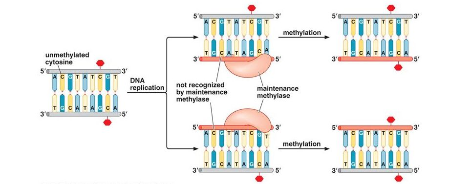
```

image source: https://slideplayer.com/slide/10719924/

## Preview: role in gene regulation 

```{r, out.width = "750px", show=TRUE, fig.align="center"}
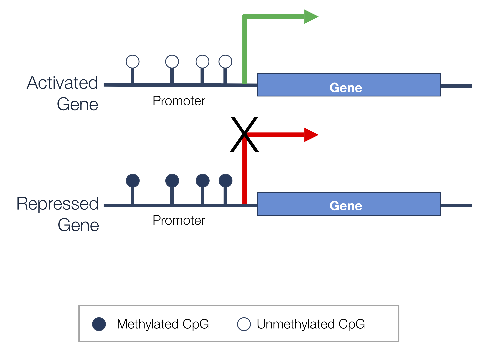
```

## Evolution of methylation assays

```{r, out.width = "700px", show=TRUE, fig.align="center"}
knitr::include_graphics("./img/methassays.png")
```
Laird 2010 (https://doi.org/10.1038/nrg2732)

## Analysis of methylation arrays {.columns-2}

* Methylation microarray (e.g. Infinum 450K, Epic 850K) analysis has similarities to expression microarray analysis
    * Signal is continuous
    * 1-16 samples per array
* Beta values: $$\beta = \frac{\text{methylated intensity}}{(\text{meth} + \text{unmeth intensity})}$$
* Analysis: regression on $logit(\beta)$
* Packages: [minfi](http://bioconductor.org/packages/minfi/), [bumphunter](http://bioconductor.org/packages/bumphunter/)

<p class="forceBreak"></p>

```{r, out.width = "450px", show=TRUE, fig.align="center"}
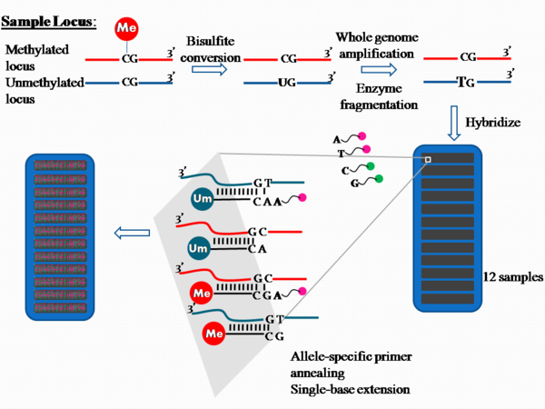
```

image: https://en.wikipedia.org/wiki/Illumina_Methylation_Assay
    
## Analysis of MeDIPseq {.columns-2}

* MeDIP-sequencing aims to sequence **only** methylated DNA
* Analysis: differential abundance (counts) on genomic bins
* Package: [MEDIPS](http://bioconductor.org/packages/MEDIPS/)

<p class="forceBreak">
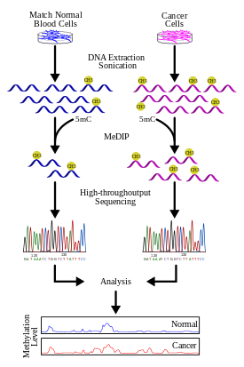 </img><br>
image source: https://en.wikipedia.org/wiki/Methylated_DNA_immunoprecipitation
</p>

## Analysis of bisulfite sequencing {.columns-2}

* Bisulfite sequencing (e.g. WGBS, RRBS)
    * basepair resolution
    * binomial count of methylated/unmethylated reads
* Packages: 
    * [bsseq](http://bioconductor.org/packages/bsseq/): smoothed t-test
    * [dss](http://bioconductor.org/packages/dss/): approximate beta-binomial regression
    * [dmrseq](http://bioconductor.org/packages/dmrseq/): approximate beta-binomial regression over regions<br>
    
<p class="forceBreak">


## Bisulfite sequencing

```{r, out.width = "1000px", show=TRUE, fig.align="center"}
knitr::include_graphics("./img/wgbscounts1.png")
```

## Bisulfite sequencing

```{r, out.width = "1000px", show=TRUE, fig.align="center"}
knitr::include_graphics("./img/wgbscounts2.png")
```

## Preprocessing

* QC ([fastQC](https://www.bioinformatics.babraham.ac.uk/projects/download.html)/[multiQC](https://multiqc.info/))
* adapter/quality trimming [Trim Galore!](https://www.bioinformatics.babraham.ac.uk/projects/trim_galore/)
* alignment with [Bismark](https://www.bioinformatics.babraham.ac.uk/projects/bismark/) 
* read into R with [bsseq](http://bioconductor.org/packages/bsseq/) package

```{r, out.width = "200px", show=TRUE, fig.align="center"}

```

## Differential methylation 

* differentially methylated cytosine (DMC) or locus (DML):
    * array: test each probe 
    * bisulfite sequencing: test each cytosine 

* differentially methylated region (DMR): 
    * array: test groups of neighboring probes 
    * bisulfite sequencing: test groups of cytosines

## DMC test of bisulfite read counts 

> - For cytosine $i$ and sample $j$ in condition $s$, we have:
> - $M_{ij}$ reads corresponding to methylation
> - $C_{ij}$ total reads covering $i$
> - $p_s$ be the methylation probability in condition $s$
> - Let $M_{ij} \sim Binom(C_{ij}, p_{s})$
> - Or equivalently, $M_{ij}$ is the sum of $C_{ij}$ draws from $Bernoulli(p_s)$
> - How to test whether $p_1 = p_2$?

## Binomial (Logisitic) regression

>- Generalized linear model for probability of success $p$: $$logit(p)=log\Big(\frac{p}{1-p}\Big) = \boldsymbol{X\beta}$$
>- Link function $g(p) = log\big(\frac{p}{1-p}\big)$ describes relationship between proportional response and linear predictor
>- No closed form; fit with iterative ML estimation
>- Interpret coefficients on original scale with inverse link function $g^{-1}$: $$ p = \frac{e^{\boldsymbol{X\beta}}}{1+e^{\boldsymbol{X\beta}}} $$
>- In R: `glm(cbind(successes, failures) ~ x, family="binomial")`

## Binomial regression with overdispersion

>- In ordinary logistic regression, $p$ is assumed to be constant for all samples with in group
>- To model *overdispersion*, we might want to allow this quantity to vary
>- For example, let $$p_s \sim Beta(\alpha_s, \beta_s)$$
>- Overdispersion parameter $\phi = \frac{1}{\alpha_s + \beta_s + 1}$ contributes to increased variance
>- Variance $\sigma^2 = p(1-p)(\alpha + \beta + n)\phi$ 
>- In R: `aod::betabin(cbind(successes,failures) ~ x, ~ x)`
 
## Pitfalls of binomial regression 

>- What happens to logit link function $log\big(\frac{p}{1-p}\big)$ if $p=0$ or $1$?
>    - binomial regression unstable for fully methylated or unmethylated cytosines
>- Computationally intensive to fit model at every cytosine
>- DSS: Park & Wu 2016 (https://doi.org/10.1093/bioinformatics/btw026)
>    - Differential methylation under general experimental design
>    - Alternate link function: $arcsine(2p-1)$
>    - Approximate fitting with Generalized Least Squares (GLS) 

## Generalized Least Squares (GLS) in a nutshell

- Hybrid of linear regression and generalized linear regression
- Pro: stable & closed form estimates (fast)
- Con: approximate
- Key idea: flexible covariance structure allows for specification of approximate beta-binomial error

## Individual cytosine differences

```{r, out.width = "900px", show=TRUE}
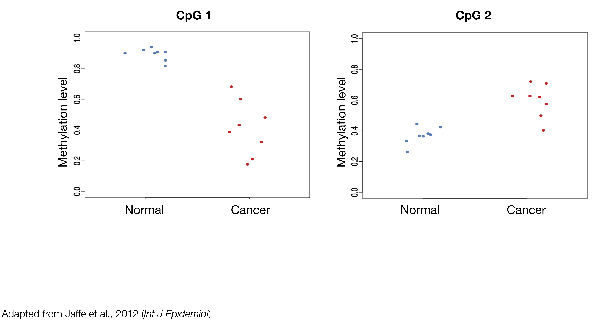
```

## CpG 1 

```{r, out.width = "800px", show=TRUE}
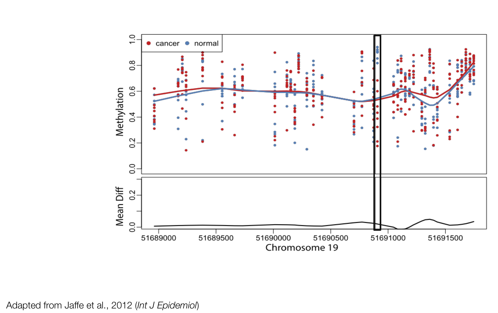
```

## CpG 2 

```{r, out.width = "800px", show=TRUE}
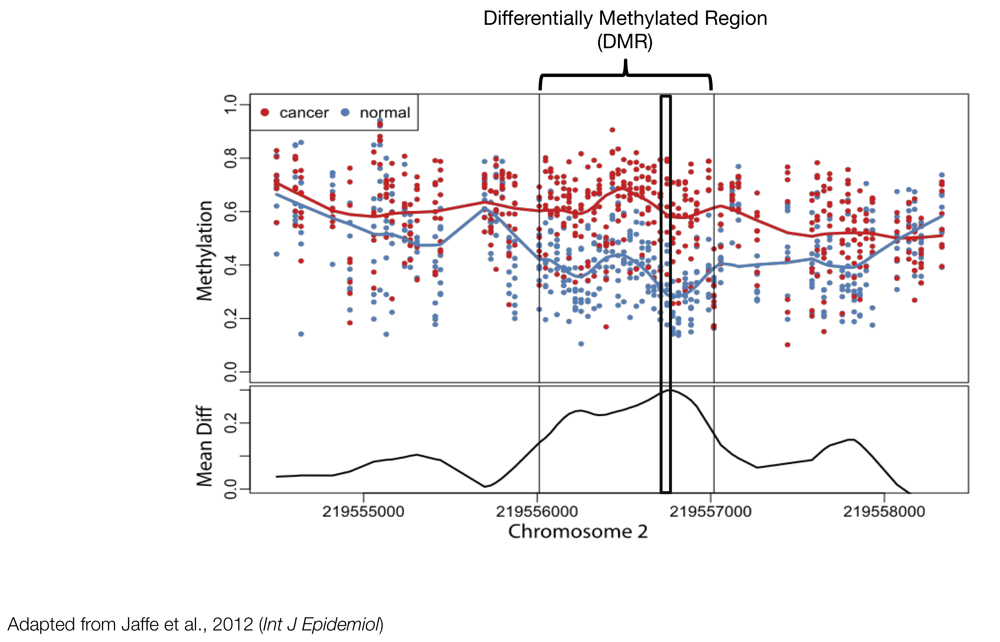
```

## Previous approaches: grouping significant CpGs

```{r, out.width = "900px", show=TRUE, fig.align="center"}
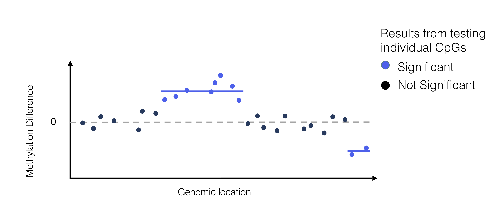
```

Examples: BSmooth ([Hansen et al. 2012](https://doi.org/10.1186/gb-2012-13-10-r83)), DSS ([Park et al. 2016](https://doi.org/10.1093/bioinformatics/btw026))

## FDR at the region level

```{r, out.width = "900px", show=TRUE, fig.align="center"}
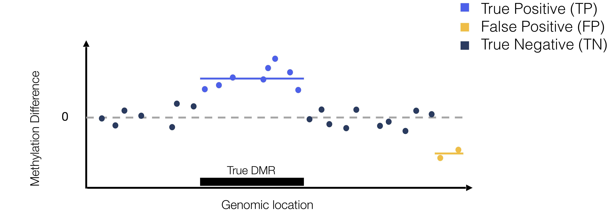
```

$$ \text{False Discovery Rate (FDR)} = E\Big[\frac{FP}{FP + TP}\Big]$$

>- $FDR_{CpG} = 2/10 = 0.20$
>- $FDR_{DMR} = 1/2 = 0.50$

## Accurate inference of DMRs

- Korthauer et al. 2018 (https://doi.org/10.1093/biostatistics/kxy007)
- Key ideas: 
    - model methylation signal over region to account for correlated signal
    - permutation to acheive accurate FDR control
- Implemented in the [dmrseq](http://bioconductor.org/packages/dmrseq/) Bioconductor package
    
```{r, out.width = "200px", show=TRUE, fig.align="center"}
knitr::include_graphics("./img/dmrseqhex.png")
```

## dmrseq: 2-stage approach

```{r, out.width = "800px", show=TRUE, fig.align="center"}
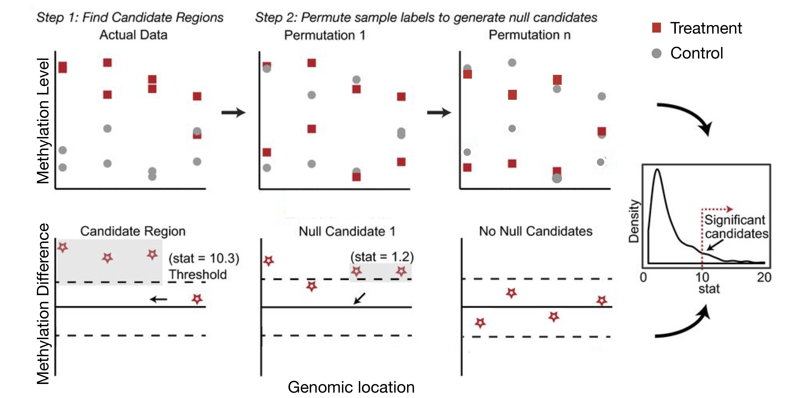
```

## Smoothing

- Red line: 35x coverage
- Black line: subsampled to 5x coverage

```{r, out.width = "900px", show=TRUE, fig.align="center"}
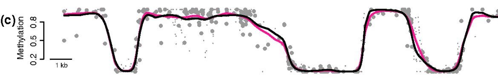
```

Hansen et al. 2012 (https://doi.org/10.1186/gb-2012-13-10-r83)

## dmrseq output

```{r, out.width = "800px", show=TRUE, fig.align="center"}
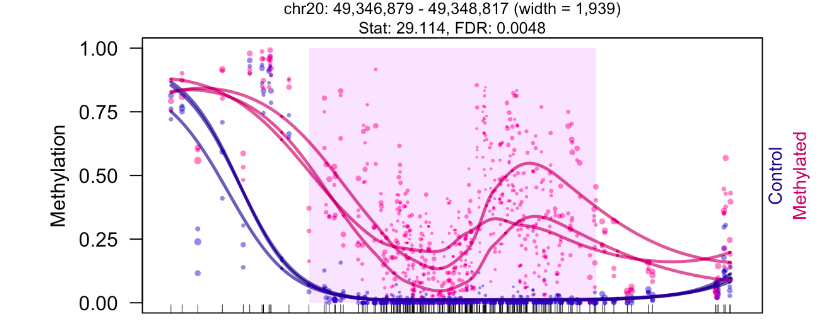
```

- *de novo* regions with FDR estimate
- ranked by effect size of methylation difference
- can adjust for covariates 

## Review: role in gene regulation 

```{r, out.width = "750px", show=TRUE, fig.align="center"}

```

## Correlation or causation?

```{r, out.width = "600px", show=TRUE, fig.align="center"}
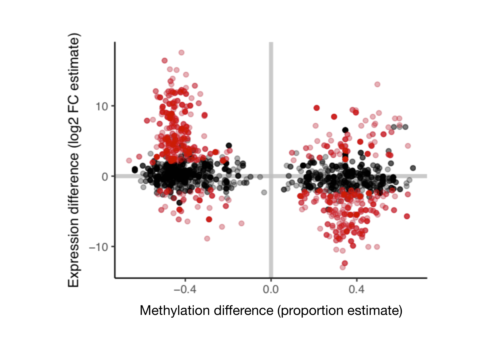
```

Korthauer et al. 2018 (https://doi.org/10.1093/biostatistics/kxy007)

## First genome-wide study of causality

```{r, out.width = "700px", show=TRUE, fig.align="center"}
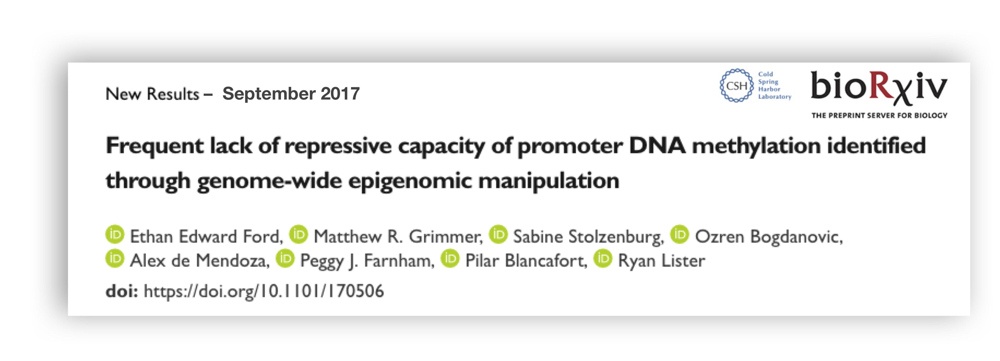
```

>- "Promoter DNA methylation is **generally not sufficient** for transcriptional inactivation" 

## Design of Ford et al. Study

```{r, out.width = "850px", show=TRUE, fig.align="center"}
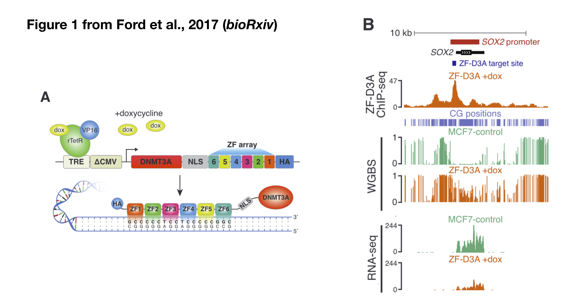
```

## Conclusion: methylation not generally sufficient

```{r, out.width = "700px", show=TRUE, fig.align="center"}
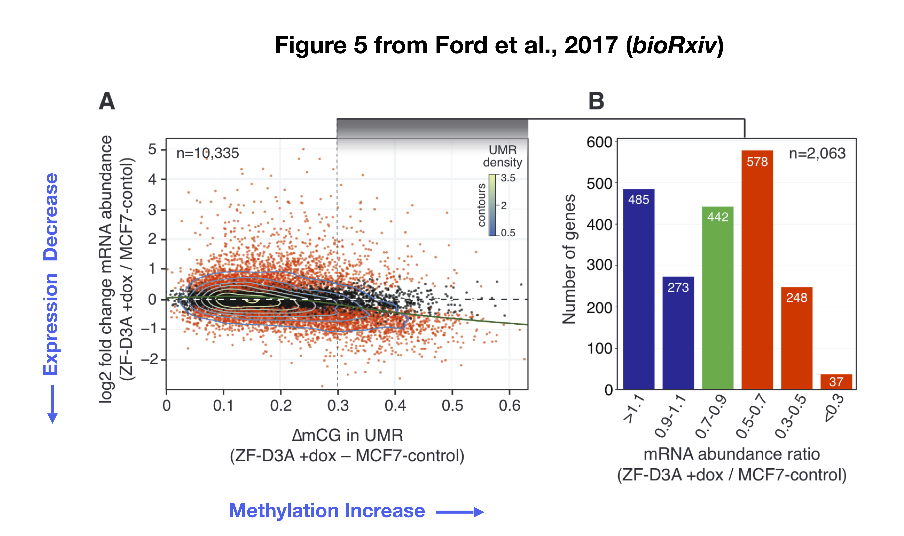
```

## Reanalysis with dmrseq

- original study used DSS
    * approach groups together individual CpGs
    * doesn't account for correlation of nearby loci
    * doesn't control error rate at the region level
- **main question : does accurate inference of methylation increase make a difference in the conclusion?**

## Results of the reanalysis

```{r, out.width = "800px", show=TRUE, fig.align="center"}
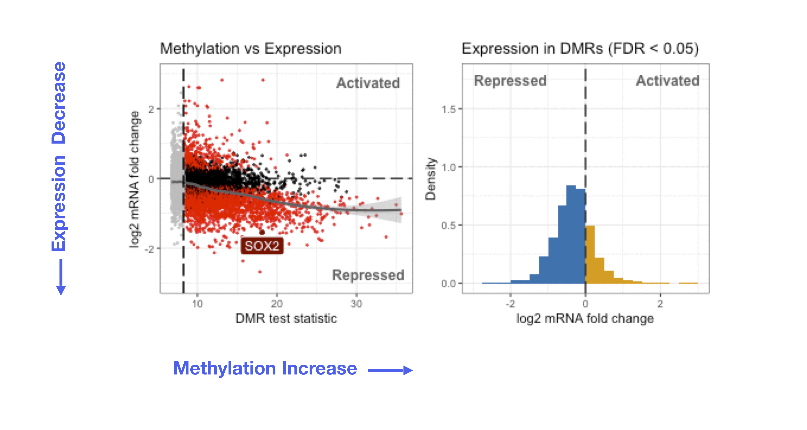
```

Korthauer & Irizarry 2018 (https://doi.org/10.1101/381145)

## Results of the reanalysis

```{r, out.width = "800px", show=TRUE, fig.align="center"}
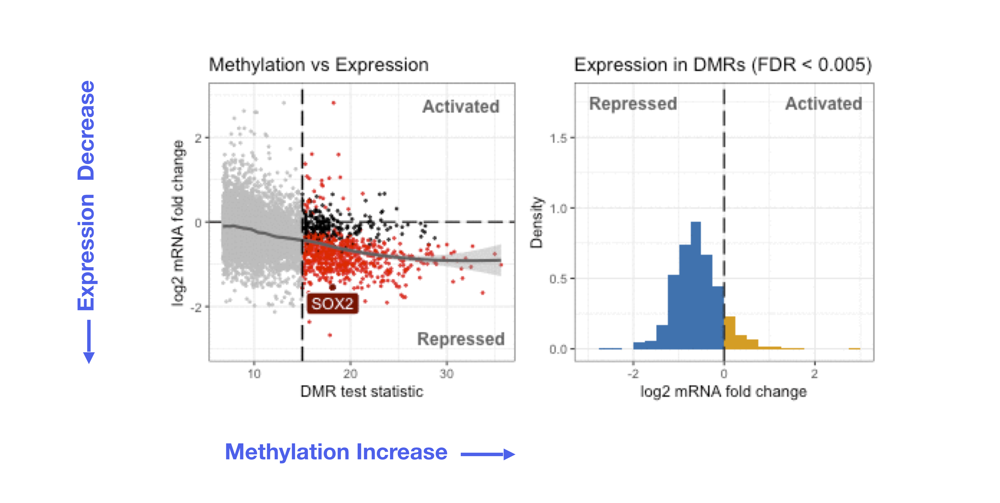
```

Korthauer & Irizarry 2018 (https://doi.org/10.1101/381145)

## Significance: statistical $\iff$ biological 

```{r, out.width = "660px", show=TRUE, fig.align="center"}
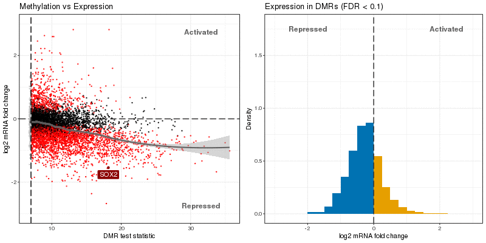
```

Korthauer & Irizarry 2018 (https://doi.org/10.1101/381145)

## 

```{r, out.width = "660px", show=TRUE, fig.align="center"}
knitr::include_graphics("./img/micdrop.gif")
```

## Packages you'll need

```{r, eval = FALSE, echo=TRUE}
# binomial regression exercises:
BiocManager::install(c("ggplot2", "dplyr", "broom", "purrr", "aod"))

# regulatory capacity vignette:
BiocManager::install(c("R.utils", "data.table", "annotatr", "dmrseq",
                       "bsseq", "DelayedMatrixStats", "dendextend", 
                       "tidyr", "BiocParallel"))
```
