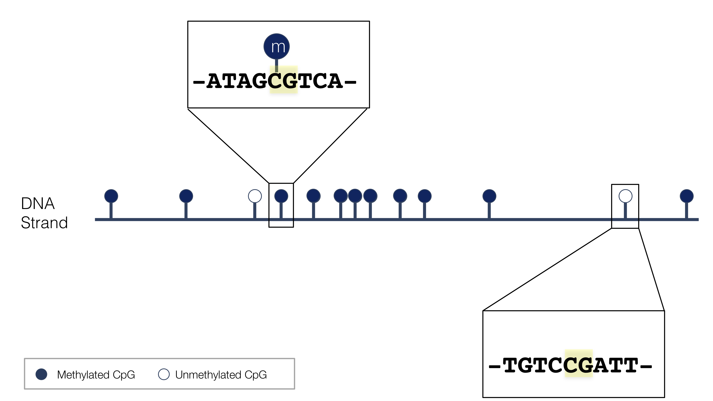

  
```{r setup, include=FALSE}
knitr::opts_chunk$set(echo = FALSE, error=FALSE, message=FALSE, warning=FALSE)
set.seed(651)
```

## DNA Methylation (5mC) 


```{r, out.width = "550px", show=TRUE, fig.align="center"}
knitr::include_graphics("./img/5mC.png")
```
image source: https://www.epigentek.com

## CpG methylation

```{r, out.width = "850px", show=TRUE, fig.align="center"}

```

## The 5th base?

* heritable upon cell division
* dynamic

```{r, out.width = "850px", show=TRUE, fig.align="center"}
knitr::include_graphics("./img/copymeth.jpg")
```

image source: https://slideplayer.com/slide/10719924/

## Preview: role in gene regulation 

```{r, out.width = "750px", show=TRUE, fig.align="center"}

```

## Evolution of methylation assays

```{r, out.width = "700px", show=TRUE, fig.align="center"}
knitr::include_graphics("./img/methassays.png")
```
Laird 2010 (https://doi.org/10.1038/nrg2732)

## Bisulfite sequencing

```{r, out.width = "1000px", show=TRUE, fig.align="center"}
knitr::include_graphics("./img/wgbscounts1.png")
```

## Bisulfite sequencing

```{r, out.width = "1000px", show=TRUE, fig.align="center"}
knitr::include_graphics("./img/wgbscounts2.png")
```

- DMCs
- binomial regression
- beta-binomial regression
- approximations
- DMRs 
- resolution
- 

## dmrseq

- [dmrseq](http://bioconductor.org/packages/dmrseq/): differentially methylated regions (Bioconductor)


