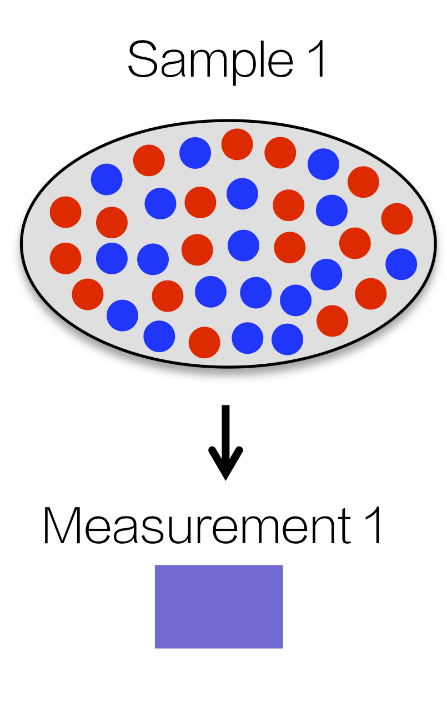
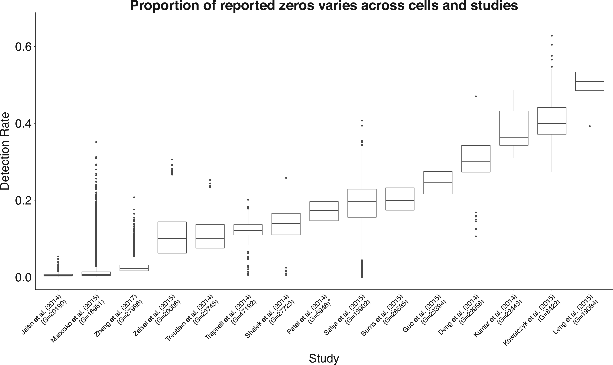
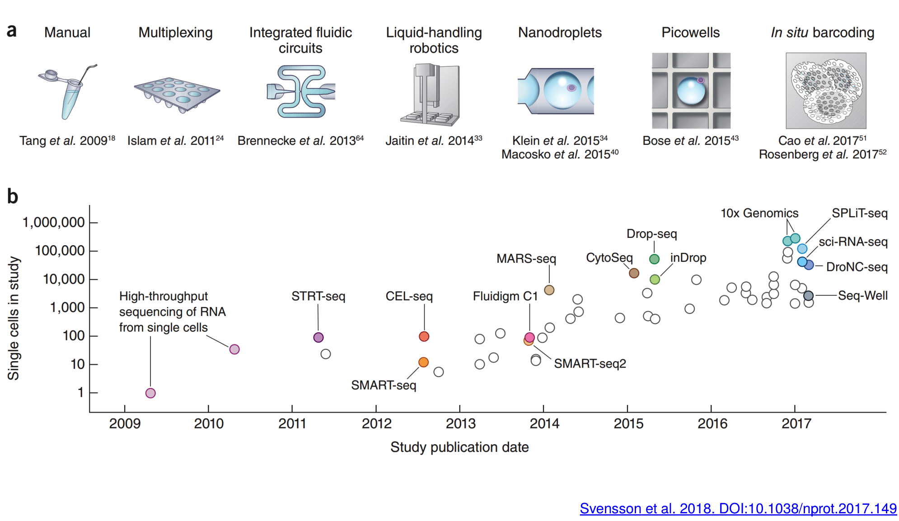
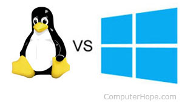
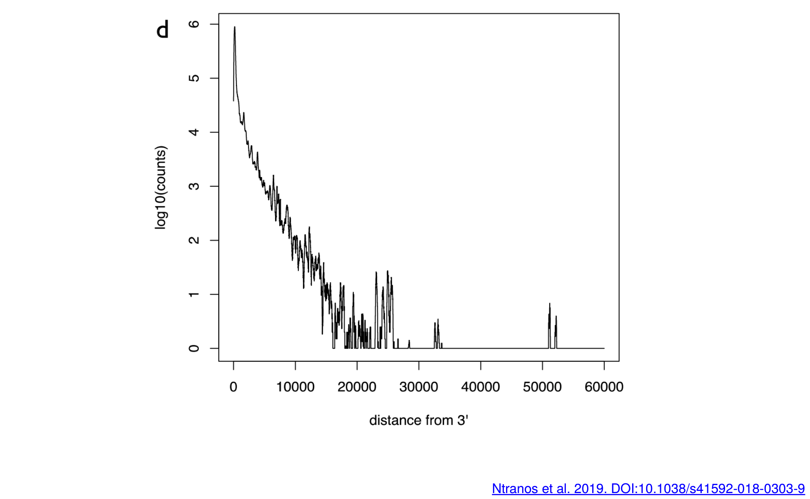
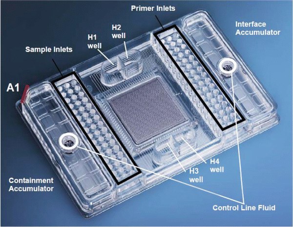
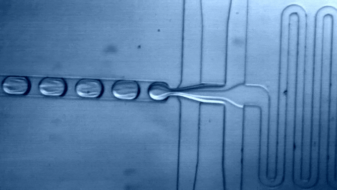

```{r setup, include=FALSE}
knitr::opts_chunk$set(echo = FALSE, error=FALSE, message=FALSE, warning=FALSE)
set.seed(651)
```

## Preview
<ol type="I">
  <li>**Introduction to single-cell RNA-seq**</li>
  <li>Quality control and Normalization</li>
  <li>Survey of downstream analysis methodology</li>
</ol>

```{r}
source("./src/smartseq.R")
```


## Transferring principles and concepts from bulk

- Count distributions with overdispersion
- Variance stabilizing transformations
- Normalization for sequencing depth
- Removal of batch effects


## Key features of single-cell 

- Heterogeneity/increased resolution
- Sparsity (few genes detected in each cell)
- New technical artifacts
    + Different protocols
    + Smaller starting material 
    + ++ Multiplexing
    
## Increased resolution in single-cell RNA-seq

```{r, out.width = "300px", show=TRUE, fig.align="center"}

```
Bulk RNA-seq measures the average expression across a pool of cells

## Sparsity in single-cell RNA-seq

```{r, fig.width=7, fig.height=4, fig.align = "center"}
hist(log10(counts(sce)[100,]+1), breaks=100, col="grey80", 
    xlab=expression(Log[10]~"count + 1"), main = paste0(rownames(sce)[100]))
```

- Detection rate = proportion of genes with nonzero measurement for that cell
- Often the vast majority of measurements are zero
- Commonly referred to as "dropout" (1-detection rate)

## New techinical artifacts

```{r, out.width = "700px", show=TRUE, fig.align="center"}

```
Hicks et al. 2018 (https://doi-org/10.1093/biostatistics/kxx053)

## Evolution of single-cell technology

```{r, out.width = "800px", show=TRUE, fig.align="center"}

```

## Terminology: platforms vs protocols

- __platforms__ isolate cells, extract mRNA, and prepare libraries for sequencing
- __protocols__ refer to the specific chemistries used to prepare sequencing libraries
- platforms may be protocol-specific (proprietary) or allow multiple protocols (open-source)

```{r, out.width = "250px", show=TRUE, fig.align="center"}

```
<div style="text-align:center">Drop-seq &nbsp;&nbsp; vs &nbsp;&nbsp; 10x &nbsp; &nbsp; </div>

## Main platform/protocol distinctions

- Full-length transcript vs 3' end only
- Plate-based vs droplet-based
- Read counts vs UMIs
- Multiplexed with barcodes vs not

## Full-length transcript vs 3' end only

```{r, out.width = "775px", show=TRUE, fig.align="center"}

```
Isoform analysis only possible with full-length

## Plate-based 

- lower throughput
- higher capture rate (% of input cells measured)
```{r, out.width = "500px", show=TRUE, fig.align="center"}

```
Adamowicz, Maratou & Aitman 2017 (https://doi-org/10.1007/978-1-4939-7481-8)

## Droplet-based (higher throughput)
- higher throughput
- lower capture rate (% of input cells measured)
```{r, out.width = "600px", show=TRUE, fig.align="center"}

```
Macosko et al. 2015 (https://doi.org/10.1016/j.cell.2015.05.002)

## Unique Molecular Identifiers (UMIs)

- PCR introduces **nonlinear** amplification bias
- UMIs are a way to tag each unique molecule in the sequencing library (before PCR)
- Number of possible UMIs = $4^L$, where $L$ is the length of the UMI
- Low $L$ or sequencing errors can cause barcode collisions
- Afterward, count up only the number of distinct UMIs (collapse reads)

## Multiplexing

- Need to pool together many cells per lane for high-throughput protocols
- Barcodes can be used to uniquely tag each cell 
- Afterward, de-multiplex by separating read/UMI counts per barcode
- Most common in droplet protocols

```{r, out.width = "300px", show=TRUE, fig.align="center", fig.show='hold'}
knitr::include_graphics(c("./img/beads2.png"))
```
image source: http://data-science-sequencing.github.io/Win2018/lectures/lecture16/

## Beads

UMIs + Barcodes can be added with specially designed plastic or hydrogel beads

```{r, out.width = "450px", show=TRUE, fig.align="center", fig.show='hold'}
knitr::include_graphics(c("./img/beads.png"))
```
Macosko et al. 2015 (https://doi.org/10.1016/j.cell.2015.05.002)

## Spike-ins

- not feasible with droplet protocols
```{r, out.width = "790px", show=TRUE, fig.align="center"}
knitr::include_graphics(c("./img/spike.jpg"))
```

Ziegenhain et al. 2017 (https://doi.org/10.1016/j.molcel.2017.01.023)

## Tradeoff between capture rate and read depth

```{r, out.width = "650px", show=TRUE, fig.align="center", fig.show='hold'}
knitr::include_graphics(c("./img/sensitivity.png"))
```
da Veiga Beltrame et al. 2019 (https://doi.org/10.6084/m9.figshare.7704659.v1)

## 

```{r, out.width = "580px", show=TRUE, fig.align="center", fig.show='hold'}
knitr::include_graphics(c("./img/cat.gif"))
```
