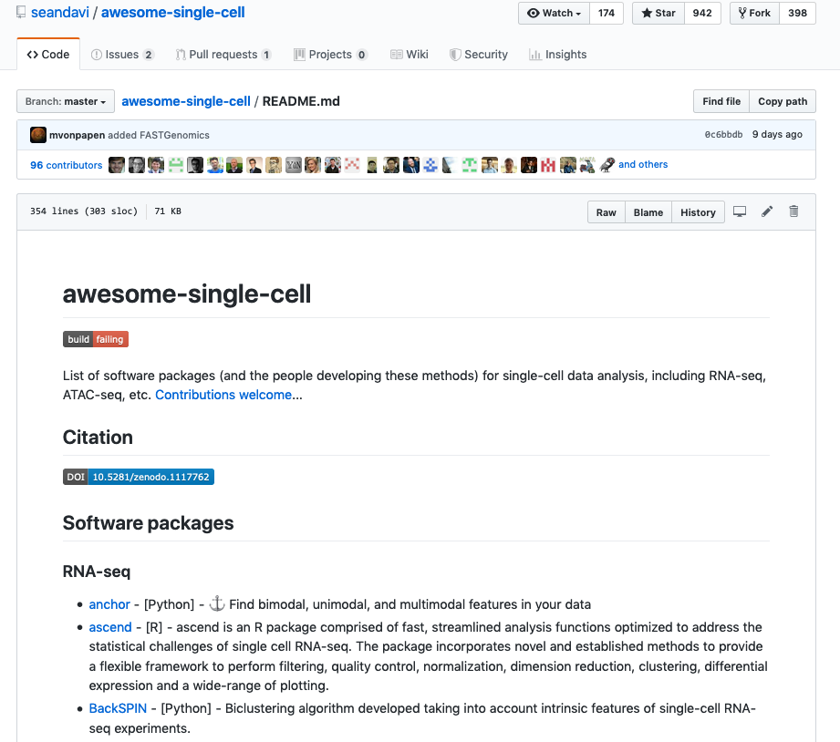

  
```{r setup, include=FALSE}
knitr::opts_chunk$set(echo = FALSE, error=FALSE, message=FALSE, warning=FALSE)
set.seed(651)
```

## Preview
<ol type="I">
  <li>Introduction to single-cell RNA-seq</li>
  <li>Quality control and Normalization</li>
  <li>**Survey of downstream analysis methodology**</li>
</ol>
  
```{r, include=FALSE}
if (!file.exists(file.path("https://www.ebi.ac.uk/arrayexpress/files",
                           "E-MTAB-5522/E-MTAB-5522.sdrf.txt"))){
  library(BiocFileCache)
  bfc <- BiocFileCache("raw_data", ask = FALSE)
  lun.zip <- bfcrpath(bfc, 
                      file.path("https://www.ebi.ac.uk/arrayexpress/files",
                                "E-MTAB-5522/E-MTAB-5522.processed.1.zip"))
  lun.sdrf <- bfcrpath(bfc, 
                       file.path("https://www.ebi.ac.uk/arrayexpress/files",
                                 "E-MTAB-5522/E-MTAB-5522.sdrf.txt"))
  unzip(lun.zip)
}
```

```{r, include=FALSE}
plate1 <- read.delim(file.path("counts_Calero_20160113.tsv"), 
                     header=TRUE, row.names=1, check.names=FALSE)
plate2 <- read.delim(file.path("counts_Calero_20160325.tsv"), 
                     header=TRUE, row.names=1, check.names=FALSE)
gene.lengths <- plate1$Length # First column is the gene length.
plate1 <- as.matrix(plate1[,-1]) # Discarding gene length (as it is not a cell).
plate2 <- as.matrix(plate2[,-1])
rbind(Plate1=dim(plate1), Plate2=dim(plate2))
all.counts <- cbind(plate1, plate2)
library(SingleCellExperiment)
sce <- SingleCellExperiment(list(counts=all.counts))
rowData(sce)$GeneLength <- gene.lengths


isSpike(sce, "ERCC") <- grepl("^ERCC", rownames(sce))
is.sirv <- grepl("^SIRV", rownames(sce))
sce <- sce[!is.sirv,] 

metadata <- read.delim(lun.sdrf, check.names=FALSE, header=TRUE)
m <- match(colnames(sce), metadata[["Source Name"]]) # Enforcing identical order.
stopifnot(all(!is.na(m))) # Checking that nothing's missing.
metadata <- metadata[m,]
head(colnames(metadata))


colData(sce)$Plate <- factor(metadata[["Factor Value[block]"]])
pheno <- metadata[["Factor Value[phenotype]"]]
levels(pheno) <- c("induced", "control")
colData(sce)$Oncogene <- pheno
table(colData(sce)$Oncogene, colData(sce)$Plate)


library(org.Mm.eg.db)
symb <- mapIds(org.Mm.eg.db, keys=rownames(sce), keytype="ENSEMBL", column="SYMBOL")
rowData(sce)$ENSEMBL <- rownames(sce)
rowData(sce)$SYMBOL <- symb
head(rowData(sce))


library(scater)
rownames(sce) <- uniquifyFeatureNames(rowData(sce)$ENSEMBL, rowData(sce)$SYMBOL)
head(rownames(sce))

library(TxDb.Mmusculus.UCSC.mm10.ensGene)
location <- mapIds(TxDb.Mmusculus.UCSC.mm10.ensGene, keys=rowData(sce)$ENSEMBL, 
                   column="CDSCHROM", keytype="GENEID")
rowData(sce)$CHR <- location
summary(location=="chrM")

mito <- which(rowData(sce)$CHR=="chrM")
sce <- calculateQCMetrics(sce, feature_controls=list(Mt=mito))
```


## There are many more tools I didn't mention...

```{r, out.width = "550px", show=TRUE, fig.align="center"}

```

## Growing number of computational tools

```{r, out.width = "650px", show=TRUE, fig.align="center"}
knitr::include_graphics("./img/toolexplosion.png")
```
Zappia, Phipson & Oshlack 2018 (https://doi.org/10.1371/journal.pcbi.1006245)

## Curated list of tools from Sean

```{r, out.width = "750px", show=TRUE, fig.align="center"}

```
