  
```{r setup, include=FALSE}
knitr::opts_chunk$set(echo = FALSE, error=FALSE, message=FALSE, warning=FALSE)
set.seed(651)
```

## Preview
<ol type="I">
  <li>Introduction to single-cell RNA-seq</li>
  <li>Quality control and normalization</li>
  <li>**Survey of downstream analysis methodology**</li>
</ol>

```{r}
source("./src/smartseq.R")
```

## Highly variable genes 

- Goal: identify a set of genes with high variability attributable to biology (over and above technical variability)
- Useful for vizualization, dimension reduction, clustering, marker gene selection, etc
- Challenging without orthogonal measurement of technical variability (e.g. spikeins)
  + with spikeins: select genes with variance significantly above mean-variance trend in control genes
  + without spikeins: select genes with variance significantly above overall mean-variance trend in all endogenous genes (**assumes variance of most genes is purely technical**)

## Highly variable genes with spikeins

```{r, fig.align="center", fig.width = 8, fig.height = 5}
library(scran)
sce <- computeSumFactors(sce)
sce <- computeSpikeFactors(sce, type="ERCC", general.use=FALSE)
sce <- normalize(sce)

var.fit <- trendVar(sce, parametric=TRUE, block=sce$Plate,
    loess.args=list(span=0.3))
var.out <- decomposeVar(sce, var.fit)

chosen.genes <- order(var.out$bio, decreasing=TRUE)[1:sum(var.out$FDR < 0.01, na.rm=TRUE)]
plot(var.out$mean[-chosen.genes], var.out$total[-chosen.genes], 
     pch=16, cex=0.6, xlab="Mean log-expression", 
     ylab="Variance of log-expression", ylim=c(0,max(var.out$total)))
curve(var.fit$trend(x), col="dodgerblue", lwd=2, add=TRUE)
cur.spike <- isSpike(sce)
points(var.out$mean[cur.spike], var.out$total[cur.spike], col="red", pch=16)
points(var.out$mean[chosen.genes], var.out$total[chosen.genes], col="orange", pch=16, cex=0.6)
legend(x="topright", pch=c(16,16,16), col=c("black", "red", "orange"), 
       legend = c("Endogeneous genes", "Spikeins", "HVG (FDR 0.01)"))
```

## Highly variable genes without spikeins

```{r, fig.align="center", fig.width = 8, fig.height = 5}
var.fit <- trendVar(sce, parametric=TRUE, block=sce$Plate,
    loess.args=list(span=0.3), use.spikes = FALSE)
var.out <- decomposeVar(sce, var.fit)

chosen.genes <- order(var.out$bio, decreasing=TRUE)[1:sum(var.out$FDR < 0.01, na.rm=TRUE)]
plot(var.out$mean[-chosen.genes], var.out$total[-chosen.genes], 
     pch=16, cex=0.6, xlab="Mean log-expression", 
     ylab="Variance of log-expression", ylim=c(0,max(var.out$total)))
curve(var.fit$trend(x), col="dodgerblue", lwd=2, add=TRUE)
points(var.out$mean[chosen.genes], var.out$total[chosen.genes], col="orange", pch=16, cex=0.6)
legend(x="topright", pch=c(16,16), col=c("black", "orange"), 
       legend = c("Endogeneous genes", "HVG (FDR 0.01)"))
```

## Review: Dimension reduction

- Useful to summarize & visualize relationships between cells in low dimensional space
- Commonly used approaches:
  + PCA (Principal Components Analysis)
  + tSNE (t-distributed Stochastic Neighbor Embedding)
  + [UMAP](https://doi.org./10.1038/nbt.4314) (Uniform Manifold Approximation and Projection)
- Clustering can be carried out on reduced dimensions, but **with caution**

## Review: PCA vs Nonlinear methods

- PCA attempts to extract the largest components of variation in the data
- Nonlinear methods such as tSNE and UMAP attempt to map points to a global coordinate system that preserves local structure
  + density & distance of points not preserved
  + better at visualizing rare subtypes

```{r, out.width = "700px", show=TRUE, fig.align="center"}
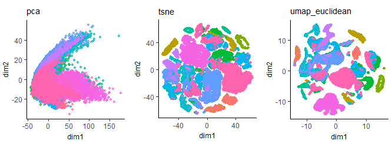
```
image source: http://carbonandsilicon.net/rblogging/2018/02/27/UMAP_plots

## General purpose clustering

- **Hierarchical**: build and cut dendrogram based on pairwise distance matrix
- **K-means**: iteratively assign cells to nearest cluster center
- **Density-based**: clusters are defined as areas of higher density (e.g. [DBSCAN](https://dl.acm.org./citation.cfm?id=3001507))
- **Graph-based**: assumes data can be represented as a graph structure; doesn't require estimating pairwise distance matrix (e.g. [SNN-Cliq](https://doi.org/10.1093/bioinformatics/btv088))

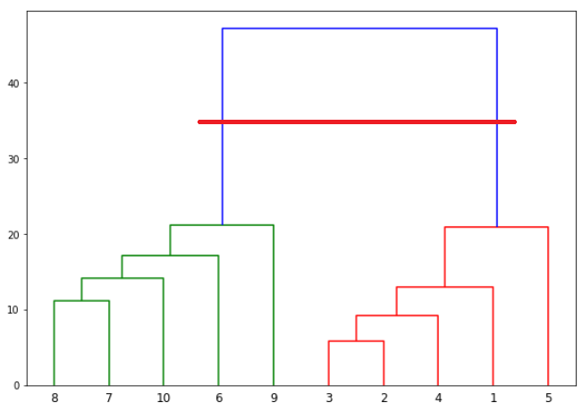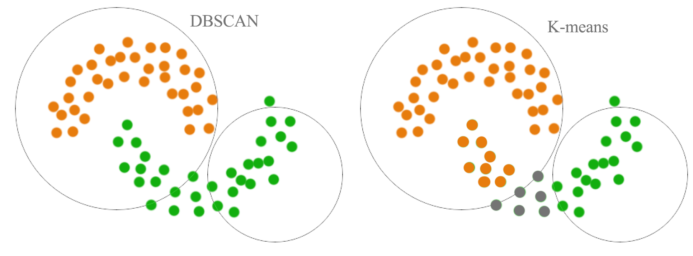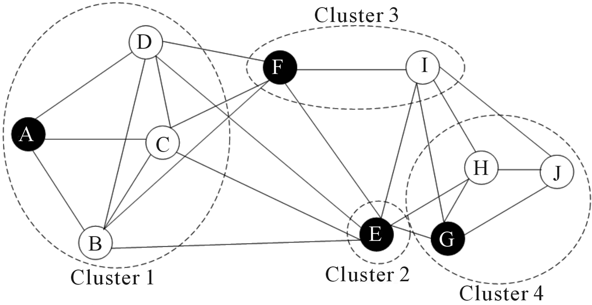


## Clustering for single-cell

- Goal: automatically identify subpopulations of cell types/states
- **Many** methods adapted/developed for single-cell to account for:
  + high dropout rate
  + batch effects
  + high dimensionality
  
```{r, out.width = "700px", show=TRUE, fig.align="center"}
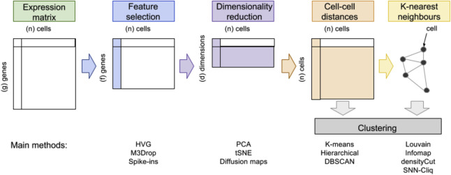
```
Andrews & Hemburg 2018 (https://doi.org/10.1016/j.mam.2017.07.002)

## Evaluation of clustering results

- Many clustering algorithms require specification of the number of clusters (e.g. **K** in K-means)
- Different algorithms may provide vastly different clusterings

```{r, out.width = "200px", show=TRUE, fig.align="center"}
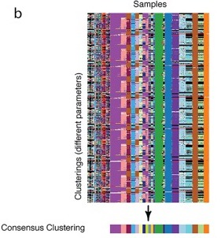
```
Risso et al 2018 (https://doi.org/10.1371/journal.pcbi.1006378)

## Metrics for evaluating clustering results

- Single clustering:
  + Average silhouette: how similar a cell is to its own cluster (average distance within) compared to other clusters (average distance between); not efficient for large numbers of cells $$s(b) = \frac{\bar{d}_{\text{within}}(b) - \bar{d}_{\text{between}}(b)}{max(\bar{d}_{\text{within}}(b), \bar{d}_{\text{between}}(b))}$$ 
  + Modularity score: difference between number of within-cluster edges to the expected number under the null (random edges)
- Comparing two clusterings
  + Adjusted rand index: similarity measure between two clusterings based on number of cells grouped accordingly and adjusted for random groupings

## Benchmark of clustering methods for single-cell

- Duo et al. 2018: https://doi.org/10.12688/f1000research.15666.2
- Bioconductor package to explore results: [DuoClustering2018](http://bioconductor.org/packages/DuoClustering2018/)

```{r, out.width = "600px", show=TRUE, fig.align="center"}
knitr::include_graphics("./img/clusterbenchmark.png")
```

## Review: Differential expression

- Traditional differential expression for bulk RNA-seq aims at detecting shifts in mean (fold change)
- Read counts $y_{bg}$ typically modeled with a two parameter distribution (e.g. mean $\mu_{bg}$, dispersion $\alpha_g$)
- Recall DESeq2 model given size factors $s_b$: $$ y_{bg} \sim NB(\mu_{bg}, \alpha_g)$$ $$\mu_{bg}=s_b q_{bg}$$ $$ log_2(q_{bg}) = x_{b.}\beta_g $$  

## Bulk RNA-seq measures averages

```{r, out.width = "550px", show=TRUE, fig.align="center"}
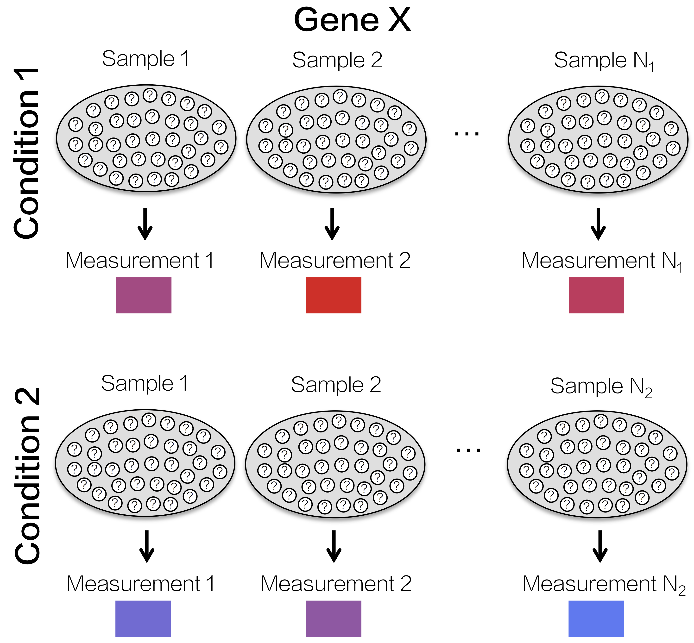
```

## Heterogeneity hidden in bulk RNA-seq

```{r, out.width = "550px", show=TRUE, fig.align="center"}
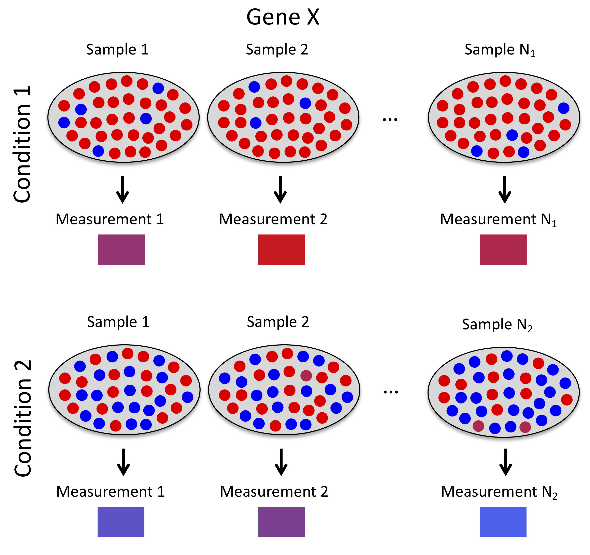
```

## Distributions of single-cell read counts

```{r, out.width = "500px", show=TRUE, fig.align="center"}
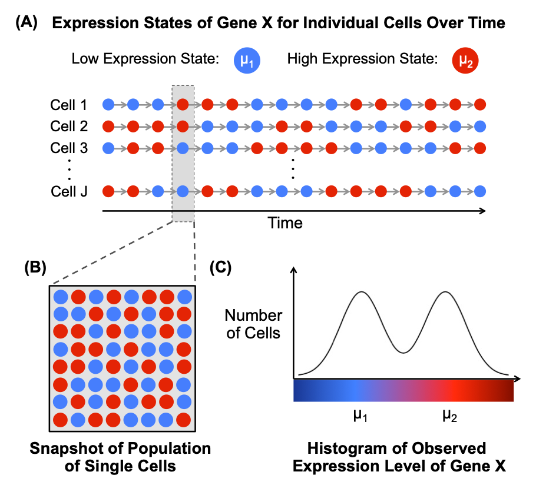
```

## scDD

```{r, out.width = "850px", show=TRUE, fig.align="center"}
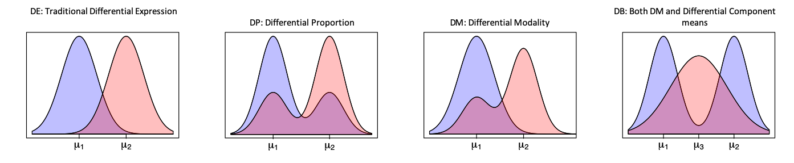
```

## scDD detects more subtle and complex changes

```{r, out.width = "450px", show=TRUE, fig.align="center"}
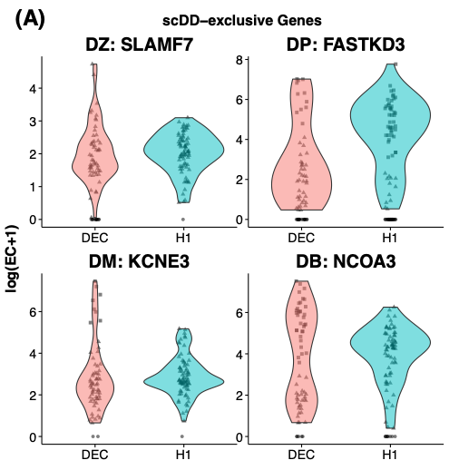
```
Korthauer et al 2016 (https://doi.org/10.1186/s13059-016-1077-y)

## DE after clustering

## R tools for downstream analysis

- [scater](http://bioconductor.org/packages/scater/): visualization, quality control (Bioconductor)
- [scran](http://bioconductor.org/packages/scran/): normalization, doublet detection, batch effect correction (Bioconductor)
- [SCnorm](http://bioconductor.org/packages/SCnorm/): normalization (Bioconductor)
- [sctransform](https://github.com/ChristophH/sctransform): normalization (CRAN)
- [DropletUtils](http://bioconductor.org/packages/DropletUtils/): removal of empty droplets (Bioconductor)
- [Seurat](https://satijalab.org/seurat/): normalization (CRAN)


## There are many more tools I didn't mention...

```{r, out.width = "550px", show=TRUE, fig.align="center"}
knitr::include_graphics("./img/titanic.gif")
```

## Growing number of computational tools

```{r, out.width = "650px", show=TRUE, fig.align="center"}
knitr::include_graphics("./img/toolexplosion.png")
```
Zappia, Phipson & Oshlack 2018 (https://doi.org/10.1371/journal.pcbi.1006245)

## Curated list of tools from Sean

```{r, out.width = "750px", show=TRUE, fig.align="center"}
knitr::include_graphics("./img/awesomesinglecell.png")
```
