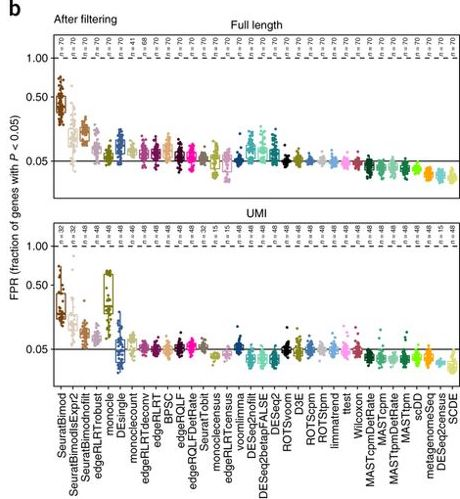

  
```{r setup, include=FALSE}
knitr::opts_chunk$set(echo = FALSE, error=FALSE, message=FALSE, warning=FALSE)
set.seed(651)
```

## Preview
<ol type="I">
  <li>Introduction to single-cell RNA-seq</li>
  <li>Quality control and normalization</li>
  <li>**Survey of downstream analysis methodology**</li>
</ol>

```{r}
source("./src/smartseq.R")
```

## Highly variable genes 

- Goal: identify a set of genes with high variability attributable to biology (over and above technical variability)
- Useful for vizualization, dimension reduction, clustering, marker gene selection, etc
- Challenging without orthogonal measurement of technical variability (e.g. spikeins)
  + with spikeins: select genes with variance significantly above mean-variance trend in control genes
  + without spikeins: select genes with variance significantly above overall mean-variance trend in all endogenous genes (**assumes variance of most genes is purely technical**)

## Highly variable genes with spikeins

```{r, fig.align="center", fig.width = 8, fig.height = 5}
library(scran)
sce <- computeSumFactors(sce)
sce <- computeSpikeFactors(sce, type="ERCC", general.use=FALSE)
sce <- normalize(sce)

var.fit <- trendVar(sce, parametric=TRUE, block=sce$Plate,
    loess.args=list(span=0.3))
var.out <- decomposeVar(sce, var.fit)

chosen.genes <- order(var.out$bio, decreasing=TRUE)[1:sum(var.out$FDR < 0.01, na.rm=TRUE)]
plot(var.out$mean[-chosen.genes], var.out$total[-chosen.genes], 
     pch=16, cex=0.6, xlab="Mean log-expression", 
     ylab="Variance of log-expression", ylim=c(0,max(var.out$total)))
curve(var.fit$trend(x), col="dodgerblue", lwd=2, add=TRUE)
cur.spike <- isSpike(sce)
points(var.out$mean[cur.spike], var.out$total[cur.spike], col="red", pch=16)
points(var.out$mean[chosen.genes], var.out$total[chosen.genes], col="orange", pch=16, cex=0.6)
legend(x="topright", pch=c(16,16,16), col=c("black", "red", "orange"), 
       legend = c("Endogeneous genes", "Spikeins", "HVG (FDR 0.01)"))
```

## Highly variable genes without spikeins

```{r, fig.align="center", fig.width = 8, fig.height = 5}
var.fit <- trendVar(sce, parametric=TRUE, block=sce$Plate,
    loess.args=list(span=0.3), use.spikes = FALSE)
var.out <- decomposeVar(sce, var.fit)

chosen.genes <- order(var.out$bio, decreasing=TRUE)[1:sum(var.out$FDR < 0.01, na.rm=TRUE)]
plot(var.out$mean[-chosen.genes], var.out$total[-chosen.genes], 
     pch=16, cex=0.6, xlab="Mean log-expression", 
     ylab="Variance of log-expression", ylim=c(0,max(var.out$total)))
curve(var.fit$trend(x), col="dodgerblue", lwd=2, add=TRUE)
points(var.out$mean[chosen.genes], var.out$total[chosen.genes], col="orange", pch=16, cex=0.6)
legend(x="topright", pch=c(16,16), col=c("black", "orange"), 
       legend = c("Endogeneous genes", "HVG (FDR 0.01)"))
```

## Review: Dimension reduction

- Useful to summarize & visualize relationships between cells in low dimensional space
- Commonly used approaches:
  + PCA (Principal Components Analysis)
  + tSNE (t-distributed Stochastic Neighbor Embedding)
  + [UMAP](https://doi.org./10.1038/nbt.4314) (Uniform Manifold Approximation and Projection)
- Clustering can be carried out on reduced dimensions, but **with caution**

## Review: PCA vs Nonlinear methods

- PCA attempts to extract the largest components of variation in the data
- Nonlinear methods such as tSNE and UMAP attempt to map points to a global coordinate system that preserves local structure
  + density & distance of points not preserved
  + better at visualizing rare subtypes

```{r, out.width = "700px", show=TRUE, fig.align="center"}
knitr::include_graphics("./img/dimred.png")
```
image source: http://carbonandsilicon.net/rblogging/2018/02/27/UMAP_plots

## General purpose clustering

- **Hierarchical**: build and cut dendrogram based on pairwise distance matrix
- **K-means**: iteratively assign cells to nearest cluster center
- **Density-based**: clusters are defined as areas of higher density (e.g. [DBSCAN](https://dl.acm.org./citation.cfm?id=3001507))
- **Graph-based**: assumes data can be represented as a graph structure; doesn't require estimating pairwise distance matrix (e.g. [SNN-Cliq](https://doi.org/10.1093/bioinformatics/btv088))


## Clustering for single-cell

- Goal: automatically identify subpopulations of cell types/states
- **Many** methods adapted/developed for single-cell to account for:
  + high dropout rate
  + batch effects
  + high dimensionality
  
```{r, out.width = "700px", show=TRUE, fig.align="center"}
knitr::include_graphics("./img/cluster.jpg")
```
Andrews & Hemburg 2018 (https://doi.org/10.1016/j.mam.2017.07.002)

## Evaluation of clustering results

- Many clustering algorithms require specification of the number of clusters (e.g. **K** in K-means)
- Different algorithms may provide vastly different clusterings

```{r, out.width = "350px", show=TRUE, fig.align="center"}
knitr::include_graphics("./img/consensus.jpg")
```
Risso et al 2018 (https://doi.org/10.1371/journal.pcbi.1006378)

## Metrics for evaluating clustering results

- Single clustering:
  + Average silhouette: how similar a cell is to its own cluster (average distance within) compared to other clusters (average distance between); not efficient for large numbers of cells $$s(b) = \frac{\bar{d}_{\text{within}}(b) - \bar{d}_{\text{between}}(b)}{max(\bar{d}_{\text{within}}(b), \bar{d}_{\text{between}}(b))}$$ 
  + Modularity score: difference between number of within-cluster edges to the expected number under the null (random edges)
- Comparing two clusterings
  + Adjusted rand index: similarity measure between two clusterings based on number of cells grouped accordingly and adjusted for random groupings

## Benchmark of clustering methods for single-cell

- Duo et al. 2018: https://doi.org/10.12688/f1000research.15666.2
- Bioconductor package to explore results: [DuoClustering2018](http://bioconductor.org/packages/DuoClustering2018/)

```{r, out.width = "600px", show=TRUE, fig.align="center"}
knitr::include_graphics("./img/clusterbenchmark.png")
```

## Review: Differential expression

- Traditional differential expression for bulk RNA-seq aims at detecting shifts in mean (fold change)
- Read counts $y_{bg}$ typically modeled with a two parameter distribution (e.g. mean $\mu_{bg}$, dispersion $\alpha_g$)
- Recall DESeq2 model given size factors $s_b$: $$ y_{bg} \sim NB(\mu_{bg}, \alpha_g)$$ $$\mu_{bg}=s_b q_{bg}$$ $$ log_2(q_{bg}) = x_{b.}\beta_g $$  

## Bulk RNA-seq measures averages

```{r, out.width = "550px", show=TRUE, fig.align="center"}
knitr::include_graphics("./img/scdd1.png")
```

## Heterogeneity hidden in bulk RNA-seq

```{r, out.width = "550px", show=TRUE, fig.align="center"}
knitr::include_graphics("./img/scdd2.png")
```

## Distributions of single-cell read counts

```{r, out.width = "500px", show=TRUE, fig.align="center"}
knitr::include_graphics("./img/scdd3.png")
```
Korthauer et al 2016 (https://doi.org/10.1186/s13059-016-1077-y)

## Differential distributions

- [scDD](http://bioconductor.org/packages/scDD/): Korthauer et al 2016 (https://doi.org/10.1186/s13059-016-1077-y)
- Key idea: **explicitly** model within sample heterogeneity and identify genes with differential distributions (as opposed to differences in mean)

```{r, out.width = "850px", show=TRUE, fig.align="center"}
knitr::include_graphics("./img/scdd4.png")
```

## scDD framework 

1. Test for global difference in distribution of expressed values with nonparametric two-sample Kolmogorov-Smirnov test:
$$ D_{n,m} = sup_x |F_{1,n}(x) - F_{2,m}(x)|$$ $$ \text{Reject at level } \alpha \text{ if } D_{n,m} > \sqrt{\frac{-(n+m)ln(\alpha)}{2mn}} $$
2. Test for difference in dropout: GLM adjusted for cellular detection rate
3. Classify significant genes into summary patterns: 
  + Fit $K-$ component normal mixture models to normalized log transformed expression values within each condition
  + Select $K$ by BIC
  + Select pattern based on number of components & their equality of means

## scDD detects more subtle and complex changes

```{r, out.width = "450px", show=TRUE, fig.align="center"}
knitr::include_graphics("./img/scdd5.png")
```
Korthauer et al 2016 (https://doi.org/10.1186/s13059-016-1077-y)

## DE after clustering

- A common workflow will include detection of DE genes between discovered subtypes (clusters)
- **Caution** must be used in the interpretation of p-values here
- Since clusters are formed by maximizing differences in expression, it is not surprising to discover DE genes between clusters - *we can even detect changes in null data*
- We may only be interested in differences in average expression here

## Alternative approach for DE in single cell

- [MAST](http://bioconductor.org/packages/MAST/): Finak et al. 2015 (http://doi.org/10.1186/s13059-015-0844-5)
- Hurdle model that depends on whether gene $g$ in cell $b$ is expressed (Normalized log count $Y_{bg} > 0$) or not ($Y_{bg} = 0$): $$ logit(P(Y_{bg} = 0)) = X_b\beta^D_g$$ $$ P(Y_{bg} | Y_{bg} > 0) \sim N(X_b\beta_g^C, \sigma_g^2) $$
- Obtain $\chi_{n}^{2}$ and $\chi_{m}^{2}$ likelihood ratio test statistics for $\beta_g^D$ and $\beta_g^C$, with $n$ and $m$ degrees of freedom, respectively 
- Global test statistic for a change in either component is the sum of the two:
  + sum of $\chi^2$ random variables yields another $\chi^2$ with degrees of freedom equal to the sum of degrees of freedom of the two original variables: $$\chi_m^{2} + \chi_n^{2} \sim \chi_{n+m}^{2}$$

## Many other approaches for DE analysis

```{r, out.width = "600px", show=TRUE, fig.align="center"}

```
Soneson & Robinson 2018 (https://doi-org.ezp-prod1.hul.harvard.edu/10.1038/nmeth.4612)

## Scaling up to millions of cells with Bioconductor

- Some datasets may be so large that they do not fit into memory efficiently (or at all)
- Handy infrastructure for computing on data that is saved on disk - allows computation on subsets:
  + HDF5 - file format interfaced with read/write functionalities in Bioconductor packages ([rhdf5](http://bioconductor.org/packages/rhdf5/), [Rhdf5lib](http://bioconductor.org/packages/Rhdf5lib/), [beachmat](http://bioconductor.org/packages/beachmat/))
  + [DelayedArray](http://bioconductor.org/packages/DelayedArray/), [DelayedMatrixStats](http://bioconductor.org/packages/DelayedMatrixStats/) - Bioconductor packages that provide an ecosystem for storing and computing on disk-backed files just like you would ordinary matrices
- Configured for use in SingleCellExperiment and interfaces automatically with [scater](http://bioconductor.org/packages/scater/) and [scran](http://bioconductor.org/packages/scran/)
  + requires saving data as HDF5 format
  
## HDF5 in action - 1.3 million cells

```{r, show=TRUE}
library(TENxBrainData)
assay(TENxBrainData(), "counts", withDimnames = FALSE)
```

## Resources for handling large data

- For a gentle introduction to the nitty gritty details of how the DelayedArray framework works, see the tutorial ["Effectively_using_the_DelayedArray_framework_for_users"](http://biocworkshops2019.bioconductor.org.s3-website-us-east-1.amazonaws.com/page/DelayedArrayWorkshop__Effectively_using_the_DelayedArray_framework_for_users/) from the 2019 Bioconductor meeting

- For practice using scater and scran with HDF5 files the tutorial ["Analysis of Large Single-Cell RNA-Seq Datasets in R/Bioconductor"](http://biocworkshops2019.bioconductor.org.s3-website-us-east-1.amazonaws.com/page/bioc2019singlecell__bioc2019singlecell/), also from the 2019 Bioconductor meeting 

## R tools for downstream analysis

- [scran](http://bioconductor.org/packages/scran/): detection of highly variable genes, dimension reduction, clustering (Bioconductor)
- [Seurat](https://satijalab.org/seurat/): detection of highly variable genes, dimension reduction, clustering, DE (CRAN)
- [mbkmeans](http://bioconductor.org/packages/mbkmeans/): minibatch K-means for large data (Bioconductor)
- [scDD](http://bioconductor.org/packages/scDD/): differential distributions (Bioconductor)
- [MAST](http://bioconductor.org/packages/MAST/): differential expression (Bioconductor)


## There are many more tools I didn't mention...

```{r, out.width = "550px", show=TRUE, fig.align="center"}
knitr::include_graphics("./img/titanic.gif")
```

## Growing number of computational tools

```{r, out.width = "650px", show=TRUE, fig.align="center"}
knitr::include_graphics("./img/toolexplosion.png")
```
Zappia, Phipson & Oshlack 2018 (https://doi.org/10.1371/journal.pcbi.1006245)

## Curated list of tools from Sean

```{r, out.width = "750px", show=TRUE, fig.align="center"}
knitr::include_graphics("./img/awesomesinglecell.png")
```
