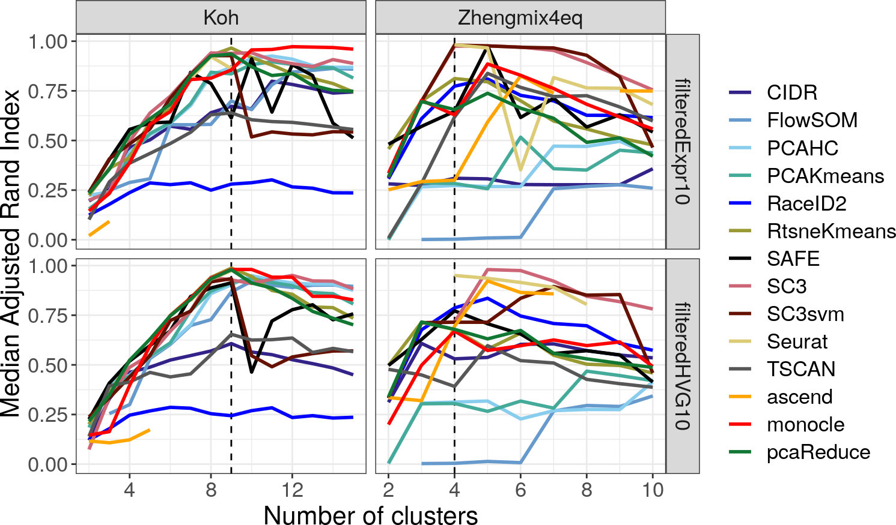

  
```{r setup, include=FALSE}
knitr::opts_chunk$set(echo = FALSE, error=FALSE, message=FALSE, warning=FALSE)
set.seed(651)
```

## Preview
<ol type="I">
  <li>Introduction to single-cell RNA-seq</li>
  <li>Quality control and normalization</li>
  <li>**Survey of downstream analysis methodology**</li>
</ol>
  
## Dimension reduction

- for viz vs clustering

## tSNE

## Clustering

```{r, out.width = "600px", show=TRUE, fig.align="center"}

```

## Differential expression

## scdd

## DE after clustering

## There are many more tools I didn't mention...

```{r, out.width = "550px", show=TRUE, fig.align="center"}
knitr::include_graphics("./img/titanic.gif")
```

## Growing number of computational tools

```{r, out.width = "650px", show=TRUE, fig.align="center"}
knitr::include_graphics("./img/toolexplosion.png")
```
Zappia, Phipson & Oshlack 2018 (https://doi.org/10.1371/journal.pcbi.1006245)

## Curated list of tools from Sean

```{r, out.width = "750px", show=TRUE, fig.align="center"}
knitr::include_graphics("./img/awesomesinglecell.png")
```
