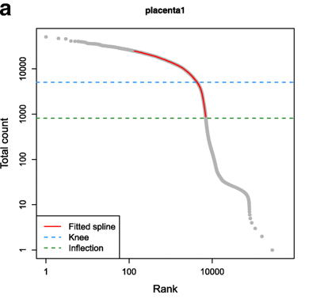
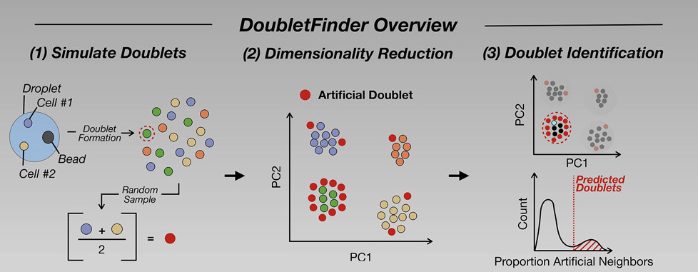
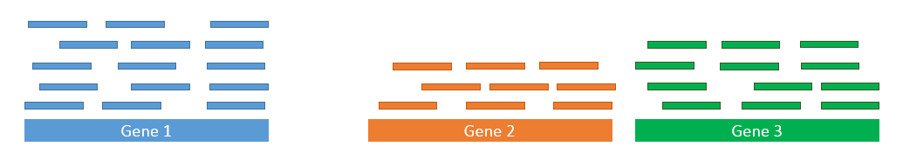
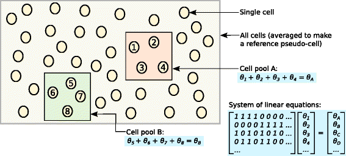
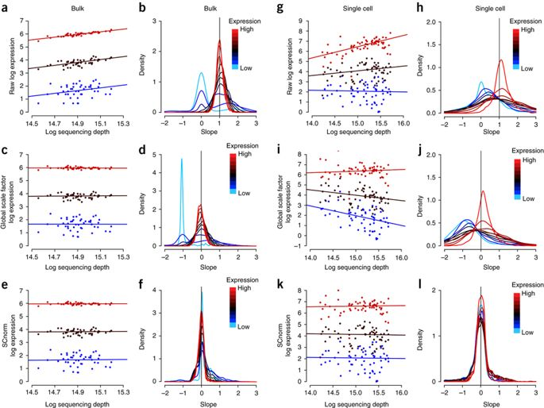
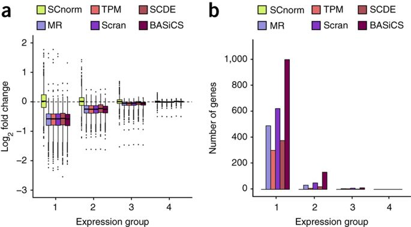
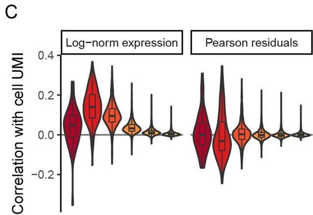
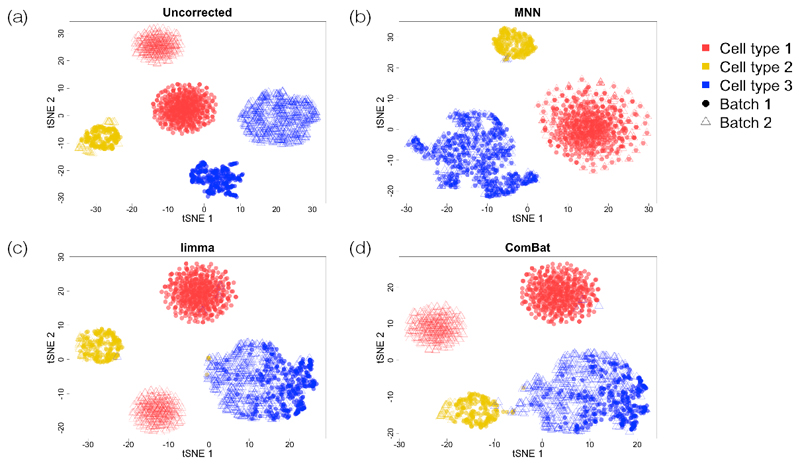
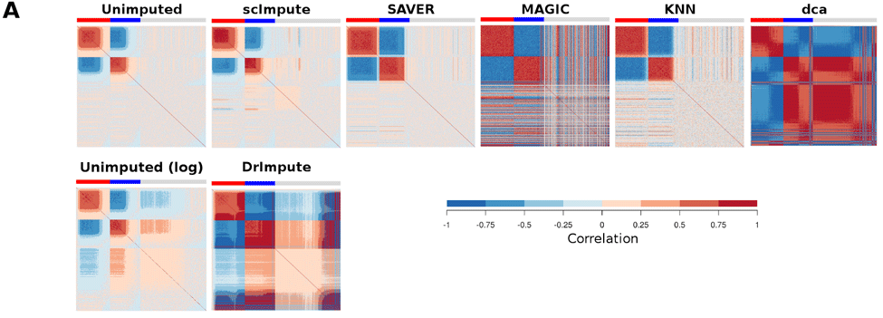

  
```{r setup, include=FALSE}
knitr::opts_chunk$set(echo = FALSE, error=FALSE, message=FALSE, warning=FALSE)
set.seed(651)
```

## Preview
<ol type="I">
  <li>Introduction to single-cell RNA-seq</li>
  <li>**Quality control and normalization**</li>
  <li>Survey of downstream analysis methodology</li>
</ol>
  
```{r}
source("./src/smartseq.R")
```

## Getting that count matrix

- standard QC on raw reads (adapter/quality trim)
- mapping to reference genome - bulk tools appropriate (e.g. Salmon, STAR, RSEM, etc)
- count reads per transcript/gene - bulk tools appropriate (e.g. Subread)
- collapse UMIs & demultiplex (if applicable) -> [scPipe]( http://bioconductor.org/packages/scPipe/)

```{r, out.width = "200px", show=TRUE, fig.align="center"}
knitr::include_graphics("./img/scPipe.png")
```

## R: SingleCellExperiment Class

```{r, out.width = "780px", show=TRUE, fig.align="center"}
knitr::include_graphics("./img/sce.png")
```

Amezquita et al. 2019 (https://doi.org/10.1101/590562)

## SingleCellExperiment Example

```{r}
sce
```
This SingleCellExperiment object has `r nrow(sce)` genes and `r ncol(sce)` cells.

## Quality control metrics

- library size (= total number of reads/UMIs)
- number of expressed features / detection rate / dropout
- expression levels by gene
- proportion of reads mapped to spike-ins (if available) or MT genes
- [Droplet] remove empty droplets
- [Droplet] remove doublets

## Library size

```{r, fig.align="center"}
plotColData(sce, y="total_counts", x="PlateOnco")
```

## Number of expressed features

```{r, fig.align="center"}
plotColData(sce, y="total_features_by_counts", x="PlateOnco")
```

## Detection rate

```{r, fig.align="center"}
colData(sce)$detection <- apply(counts(sce), 2, function(x) sum(x > 0)/length(x))
plotColData(sce, y="detection", x="PlateOnco")
```

## Expression levels by gene - highest

```{r, fig.align="center"}
plotHighestExprs(sce, n=20)
```

## Expression levels by gene - average

```{r, fig.align="center"}
hist(log10(calcAverage(sce, use_size_factors=FALSE)), 
     breaks=100, main="", col="grey80", 
     xlab=expression(Log[10]~"average count"))
```

## Proportion of reads mapped to endogenous transcripts

```{r, fig.align="center", fig.width = 9}
multiplot(
    plotColData(sce, y="pct_counts_ERCC", x="PlateOnco"),
    plotColData(sce, y="pct_counts_Mt", x="PlateOnco"),
    cols=2)
```

## [Droplet] Remove empty droplets

- Ideally each droplet contains one cell and one bead
- Process of adding cells (and beads) to droplets is stochastic, approximated by a Poisson process:
$$ P(k \text{ cells in a droplet}) = \frac{e^{-\lambda}\lambda^k}{k!}$$
- Typically cells are added at a low rate ($\lambda$ << 1) to reduce the chance that a droplet contains multiple cells
- Unfortunately, this means many droplets contain zero cells
- Also unfortunately, reads still map to droplets with no cells

## Simple idea: empty droplets have fewest reads

```{r, out.width = "400px", show=TRUE, fig.align="center", fig.cap="Lun et al. 2019, (https://doi.org/10.1186/s13059-019-1662-y)"}

```
- e.g. Quantile (CellRanger), Knee plot (Drop-seq)
- This risks removing cells with low biological material

## More sophisticated idea: EmptyDrops 

- Lun et al. 2019, (https://doi.org/10.1186/s13059-019-1662-y)
- **Key idea**: expression profile of empty droplets $\sim$ ambient RNA - Estimate ambient RNA profile by pooling across all cells/barcodes
- Ambient expression $A_g$ for gene $g$ is sum of counts $y_{bg}$ over all barcodes $b$:
$$ A_g = \sum_b y_{bg}  $$
- Counts for barcode $b$ conditional on total counts for barcode $b$ ~ Dirichlet-multinomial
  + allows for overdispersion (analogous to Gamma-poisson)
- Barcodes with strong deviations (permutation test on likelihood) are determined to be cells

## EmptyDrops rescues cells with few reads

```{r, out.width = "450px", show=TRUE, fig.align="center", fig.cap="Lun et al. 2019, (https://doi.org/10.1186/s13059-019-1662-y)"}
knitr::include_graphics("./img/emptydrops.png")
```

## [Droplet] Remove doublets

- Even with the low cell rate, occasionally droplets contain two or more cells
- Can also happen in plate-based protocols (though rare) due to improper cell sorting/capture
- Simple idea: remove barcodes with especially high numbers of reads - works poorly with diverse cell types

## More sophisticated idea: cluster mixtures

- Bach et al. 2017 (https://doi.org/10.1038/s41467-017-02001-5)
- Key idea: remove cells that look like a mixture of two clusters

```{r, out.width = "500px", show=TRUE, fig.align="center"}
knitr::include_graphics("./img/scrublet.jpg")
```

## Another sophisticated idea: simulate doublets

- Scrublet: Wolock, Lopez & Klein 2019 (https://doi.org/10.1016/j.cels.2018.11.005)
- DoubletFinder: McGinnis, Murrow & Gartner 2019 (https://doi.org/10.1016/j.cels.2019.03.003)
- Dahlin et al. 2018 (https://doi.org/10.1182/blood-2017-12-821413)
- Key idea: remove cells that look like simulated doublets

```{r, out.width = "600px", show=TRUE, fig.align="center"}

```

## Normalization

- Now that we've removed problematic cells, need to put counts on a comparable scale before/during downstream analysis
- Main factors to account for:
  + library size / sequencing depth
  + batch effects (known or unknown)

## Review: Sequence more, obtain more reads

```{r, out.width = "500px", show=TRUE, fig.align="center"}
knitr::include_graphics("./img/libsize1.png")


```

- DESeq2 library size factors use the median ratio method - Anders and Huber 2010 (https://doi.org/10.1186/gb-2010-11-10-r106): $$ \hat{s}_b = \text{median}_g \frac{y_{bg}}{(\prod_{j=1}^B y_{gj})^{1/B}} $$
- assumes majority of genes are not differentially expressed

## Median ratio method in single-cell

- Consider this quantity in single-cell: $$ \hat{s}_b = \text{median}_g \color{red}{\frac{y_{bg}}{(\prod_{j=1}^B y_{gj})^{1/B}}} $$
- For every gene $g$ where $y_{bg} = 0$ for any $b$, the highlighted quantity will be undefined
- This means that the quantity is only computed **for genes that are nonzero in every cell**
- As a result, log CPM normalization commonly used for single-cell: $$ log( \frac{y_{bg}*10^6}{\sum_b y_{bg}} + 1) $$

## Pooling & deconvolution normalization

- scran: Lun et al. 2016 (https://doi.org/10.1186/s13059-016-0947-7) proposed a **pooling & deconvolution** approach

- Cells are pooled together and normalized against a global pseudoreference, then deconvolved by solving a system of linear equations 

```{r, out.width = "460px", show=TRUE, fig.align="center"}

```

## Quantile regression normalization

- SCnorm: Bacher et al. 2017 (https://doi.org/10.1038/nmeth.4263) 
- Key idea: groups of genes get separate size factors based on observed count-depth relationship
- Ignores zeroes (developed for plate-based read count data)

```{r, out.width = "500px", show=TRUE, fig.align="center"}

```

## SCnorm reduces spurious discoveries

```{r, out.width = "650px", show=TRUE, fig.align="center"}

```

Bacher et al. 2017 (https://doi.org/10.1038/nmeth.4263) 

## Related idea: NB GLM residuals normalization 

- scTransform: Hafemeister & Satija 2019 (https://doi.org/10.1101/576827)
- Fits negative binomial generalized linear model for groups of genes with similar geometric means: $$ log(E(y_{bg})) = \beta_0 + \beta_1 log_{10}(t_b), $$ where $t_b = \sum_g y_{bg}$ is the library size for cell $b$
- Key idea: normalized counts are taken as residuals of the above model ('regressing out' library size)

## scTransform reduces correlation with depth

```{r, out.width = "400px", show=TRUE, fig.align="center"}

```
Hafemeister & Satija 2019 (https://doi.org/10.1101/576827)

## Batch effects (equal cell composition)

- When batches are known and cell populations are identical across batches $z_b$ (e.g. evenly split across two plates & homogeneous), can estimate effects due to batch

- limma: Ritchie et al. 2015 (https://doi/org/10.1093/nar/gkv007) 
  + fit a linear model to log-normalized counts to estimate batch effects $\beta_2$ and effects of interest $\beta_1$:  $$ log(y_{bg}) = \beta_0 + \beta_1 x_b + \beta_2 z_{b} $$
  + remove batch effect: $$ log(y_{bg}) - \beta_2 z_{b} $$

- see also Combat: Johnson & Rabinovic 2007 (https://doi.org/10.1093/biostatistics/kxj037), implemented in [sva](http://bioconductor.org/packages/sva/)

## Batch effects (unknown cell compositions)

- When batch composition is unknown/variable, can't estimate common batch effect

```{r, out.width = "500px", show=TRUE, fig.align="center"}
knitr::include_graphics("./img/mnn.jpg")
```
- MNNcorrect: Haghverdi et al. 2018 (https://doi.org/10.1038/nbt.4091) aligns cells based on their mutual nearest neigbors

- See also Seurat: Butler et al. 2018 (https://doi.org/10.1038/nbt.4096)


## MNNcorrect can align heterogeneous batches

```{r, out.width = "600px", show=TRUE, fig.align="center"}

```
Haghverdi et al. 2018 (https://doi.org/10.1038/nbt.4091) 

## Variance stabilizing transformations 

- Review: a VST removes the dependence of the variance on the mean
- It's useful to a apply variance stabilizing transformation before:
  + visualization
  + selecting highly variable genes
  + using downstream analysis tools that don't explicitly model count data (e.g. MAST, scDD)
- Examples: 
  + log (ideal when relative differences are important rather than absolute; requires addition of a pseudocount)
  + DESeq2::vst (estimates and removes trend of mean and variance)
- Not necessary if data is already log CPM normalized

## Example: log and DESeq2::vst

```{r, out.width = "900px", out.height = "350px", show=TRUE, fig.align="center"}
par(mfrow=c(1,3))
smoothScatter(log(rowMeans(counts(sce))), log(rowVars(counts(sce))), 
     xlab="log Mean expression", 
     ylab="log Variance of expression")
smoothScatter(rowMeans(log(counts(sce) + 1)), rowVars(log(counts(sce) + 1)), 
     xlab="Mean log-expression", 
     ylab="Variance of log-expression")
vstc <- DESeq2::vst(counts(sce))
smoothScatter(rowMeans(vstc), rowVars(vstc), 
     xlab="Mean vst expression", 
     ylab="Variance of vst expression")
```

## Should we impute zeroes?

```{r, out.width = "400px", show=TRUE, fig.align="center"}
knitr::include_graphics("./img/suspicious.gif")
```

## Imputation can have unintended consequences

```{r, out.width = "800px", show=TRUE, fig.align="center"}

```
Andrews & Hemburg 2019 (https://doi.org/10.12688/f1000research.16613.1)

## R tools for quality control and normalization

- [scater](http://bioconductor.org/packages/scater/): visualization, quality control (Bioconductor)
- [scran](http://bioconductor.org/packages/scran/): normalization, doublet detection, batch effect correction (Bioconductor)
- [SCnorm](http://bioconductor.org/packages/SCnorm/): normalization (Bioconductor)
- [sctransform](https://github.com/ChristophH/sctransform): normalization (CRAN)
- [DropletUtils](http://bioconductor.org/packages/DropletUtils/): removal of empty droplets (Bioconductor)
- [Seurat](https://satijalab.org/seurat/): normalization (CRAN)


## Installing packages we'll use today

```{r, eval=FALSE, echo = TRUE}
# workflow that includes many of the packages we'll explore
BiocManager::install("simpleSingleCell")

# other individual packages not included in the above
BiocManager::install("SCnorm")
BiocManager::install("sctransform")
```
